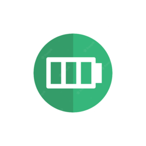
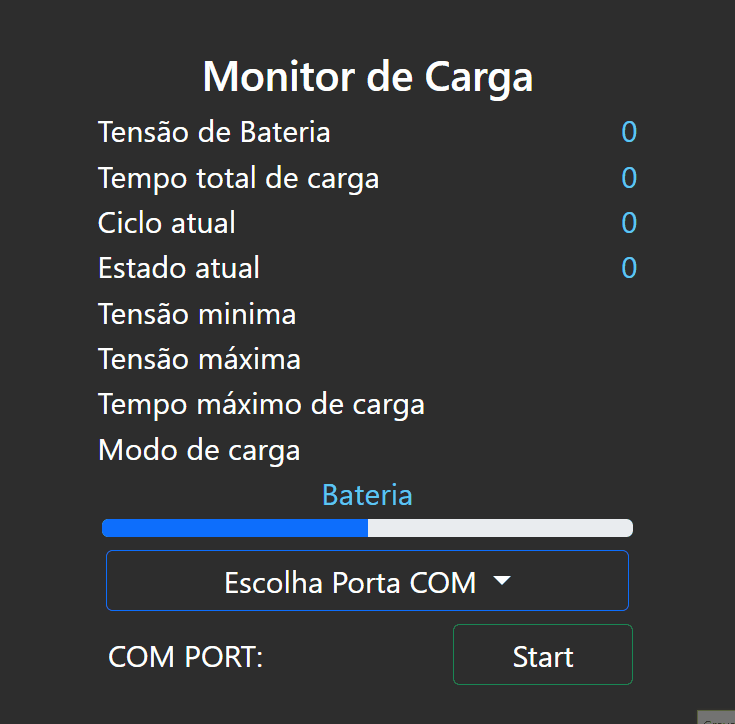

<h1 align="center">
  <br>
  <a href="#"></a>
  <br>
  Monitor de carga V0
  <br>
</h1>

<h4 align="center">Leitor Serial para uso em conjuto com sistema Arduino usando <a href="http://electronjs.org" target="_blank">ElectronJS</a>.</h4>

<p align="center">
  <a href="#key-features">Características</a> •
  <a href="#how-to-use">Como usar</a> •
  <a href="#download">Clone e build</a> •
  <a href="#credits">Creditos</a> •
</p>



## Características

* Seletor Porta Com
  - Veja no menu dropdown as portas disponiveis no computador e seu fabricante.
* Recebe e exibe o status de carga
  - Enquanto carrega, o sistema envia os dados e o monitor os recebe e exibe.
* Recebe e exibe as configuraçõe do modo de carga
  - Exibe os parâmetros chave do modo atual.
* Mantêm o fluxo de dados da serial ativo e de forma automática
* Barra de status de carga animada
* Compatível com sistemas que utilizam protocolo UART (Ex.: Arduino) 
* Compatível com sistema Windows x86 e x64, (Builds distintas)
* Cross platform ready
  - Necessário build exclusiva do ElectronJS.

## Como usar

Para usar esta aplicação é necessário obedecer ao padrão de transmissão abaixo. Uma vez que o sistema alvo esteja enviando os dados, o Monitor de carga irá receber e processar. Para ter um guia de sistema que utiliza o recurso veja o Sistema MUF800R00 [Github](https://github.com/marcostech/Projetos_Sistemas_Embarcados). 
Este padrão de transmissão foi escrito na linguagem utilizada na plataforma Arduino, portanto pode ser usado em seu projeto sem a adição de outras bibliotecas.
O baudrate do sistema deve ser 115200.

```
# Todo pacote de dados deve ser enviado desta forma, obedecendo a 
# separação por CSV ',' e por delimitadores de inico e fim de transmissão.
# inico do pacote 
# '<'
# ...
# 'Pacote'
# ...
# '>'
# 'new Line char'
# fim do pacote
    Serial.begin(115200); //Manter este baudrate
    Serial.print(F("<"));  
    Serial.print(F(","));
    Serial.print(F("V: "));
    Serial.print(/* Sua tensão de bateria */);  
    Serial.print(F(","));
    Serial.print(F("T: "));
    Serial.print(/* Seu tempo atual */);  
    Serial.print(F(","));
    Serial.print(F("C: "));
    Serial.print(/* Seu ciclo atual */);  
    Serial.print(F(","));
    Serial.print(F("S: "));
    Serial.print(/* Seu estado atual */);  
    Serial.print(F(","));
    Serial.print(F("CFG1: "));
    Serial.print(/* Sua configuração de tensão minima */);  
    Serial.print(F(","));
    Serial.print(F("CFG2: "));
    Serial.print(/* Sua configuração de tensão máxima */);  
    Serial.print(F(","));
    Serial.print(F("CFG3: "));
    Serial.print(/* Sua configuração de tempo máximo */);  
    Serial.print(F(","));
    Serial.print(F("CFG4: "));
    Serial.print(/* Sua configuração de modo atual */);  
    Serial.print(F(","));
    Serial.print(F(">"));
    Serial.println();
```

> **Nota**
> Se você não estiver usando estas funções para envio de dados na porta Serial basta enviar os dados conforme está descrito no exemplo (<,...Pacote1,Pacote2,...,>'newLineChar'), prestando atenção no 'new Line char' que só deve ser enviado ao final.


## Clone e Build

Você deve fazer o clone do projeto e então sua build para a plataforma alvo(Windows x86/64).Em caso de duvidas veja o guia de build do ElectronJS. [Guia](https://www.electronjs.org/docs/latest/tutorial/tutorial-packaging).
>**Nota**
> Para definir a arquitetura da build você pode passar o comando make com argumentos.
```bash
#Windows 32bits
npm run make -- --arch=ia32
#Windows 64bits
npm run make -- --arch=x64
```

## Creditos

Esse Software utiliza os pacotes Open Source abaixo:

- [Electron](http://electronjs.org/)
- [Node.js](https://nodejs.org/en)
- [NodeSerial](https://serialport.io/)
- [Arduino](https://www.arduino.cc/)