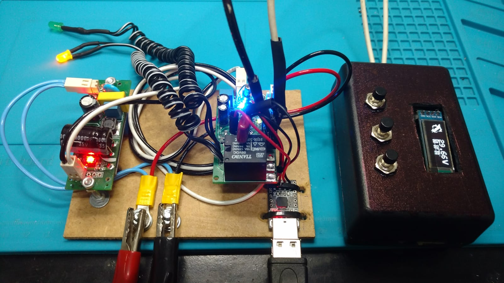
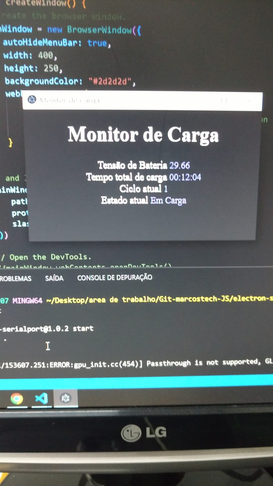

# Desktop Dashboard Serial-APP: utilizando Electron JS
## Usando a biblioteca Node SerialPort para comunicação serial
## Caracteristicas: 
### Sistema roda primariamente em windows(necessário teste em outros SO's)
### Usuario pode escolher a porta COM a ser aberta e lida em tempo real
### Sistema lê os dados da placa MUF800R00 (ou Arduino)
#### Necessário respeitar codificação dos dados enviados pela serial
### TODO: função close, refresh/retry, comunicação bluetooth/wifi
### Abaixo sistema rodando 

