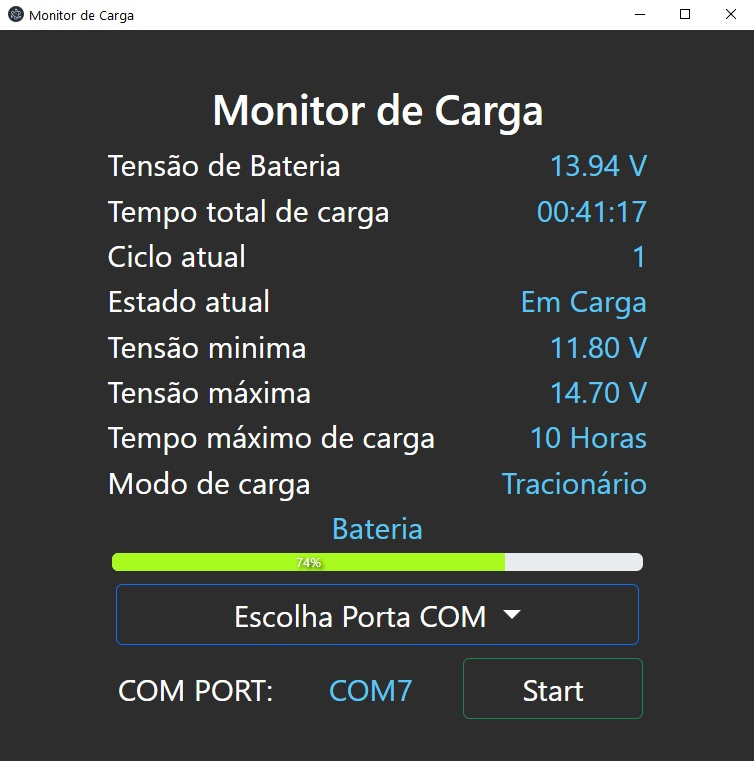

# Desktop APP utilizando Electron JS
## Usando também a biblioteca WebSerialAPI - https://web.dev/serial/
## Sistema funciona na porta COM7, seletor de porta será feito em outro momento
## Abaixo sistema rodando

